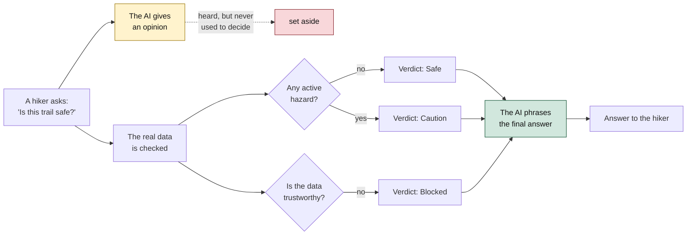

# Diagram 1: How a Question Becomes an Answer

A plain-language view of the pipeline built in this chapter: the AI's
opinion is heard but never trusted; the actual decision comes from
checking the real data.

