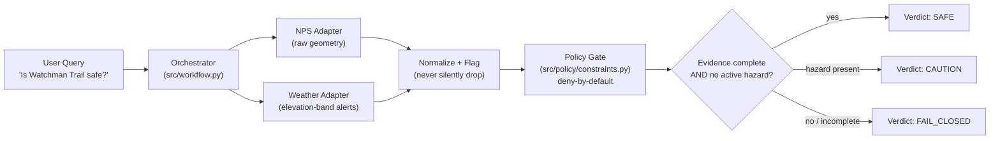

# Workflow Diagram 1: High-Level Architecture

Corresponds to chapter section 1.1-1.2 (production reality, stateless
model limits) and 1.4 (deterministic guardrails).

```mermaid
flowchart LR
    U["User Query<br/>'Is Watchman Trail safe?'"] --> O["Orchestrator<br/>(src/workflow.py)"]
    O --> A1["NPS Adapter<br/>(raw geometry)"]
    O --> A2["Weather Adapter<br/>(elevation-band alerts)"]
    A1 --> N["Normalize + Flag<br/>(never silently drop)"]
    A2 --> N
    N --> P["Policy Gate<br/>(src/policy/constraints.py)<br/>deny-by-default"]
    P --> V{"Evidence complete<br/>AND no active hazard?"}
    V -- "yes" --> SAFE["Verdict: SAFE"]
    V -- "hazard present" --> CAUTION["Verdict: CAUTION"]
    V -- "no / incomplete" --> FAIL["Verdict: FAIL_CLOSED"]
```
