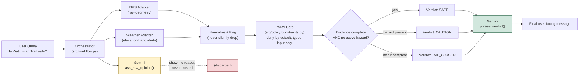

# Diagram 1: High-Level Architecture

Corresponds to sections 1.1 (no undo button), 1.2-1.3 (stateless model
limits, confident hallucinations), and 1.4 (deterministic guardrails).

```mermaid
flowchart LR
    U["User Query<br/>'Is Watchman Trail safe?'"] --> O["Orchestrator<br/>(src/workflow.py)"]
    O --> A1["NPS Adapter<br/>(raw geometry)"]
    O --> A2["Weather Adapter<br/>(elevation-band alerts)"]
    O --> L1["Gemini<br/>ask_raw_opinion()"]

    A1 --> N["Normalize + Flag<br/>(never silently drop)"]
    A2 --> N
    L1 -. "shown to reader,<br/>never trusted" .-> DISCARD["(discarded)"]

    N --> P["Policy Gate<br/>(src/policy/constraints.py)<br/>deny-by-default, typed input only"]
    P --> V{"Evidence complete<br/>AND no active hazard?"}
    V -- "yes" --> SAFE["Verdict: SAFE"]
    V -- "hazard present" --> CAUTION["Verdict: CAUTION"]
    V -- "no / incomplete" --> FAIL["Verdict: FAIL_CLOSED"]

    SAFE --> L2["Gemini<br/>phrase_verdict()"]
    CAUTION --> L2
    FAIL --> L2
    L2 --> OUT["Final user-facing message"]

    style DISCARD fill:#f8d7da,stroke:#842029
    style L1 fill:#fff3cd,stroke:#997404
    style L2 fill:#d1e7dd,stroke:#0f5132
```
