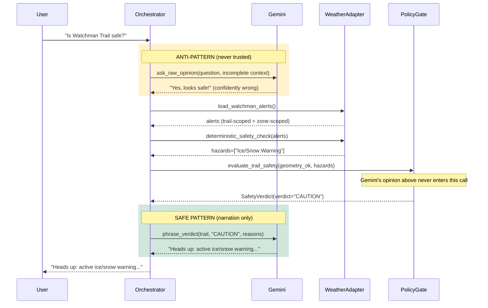

# Workflow Diagram 2: Orchestrator Sequence (The Conductor)

Corresponds to section 1.2: the model is not treated as a decision-maker.
It is called twice, for two different, non-overlapping jobs.

```mermaid
sequenceDiagram
    participant User
    participant Orchestrator
    participant Gemini
    participant WeatherAdapter
    participant PolicyGate

    User->>Orchestrator: "Is Watchman Trail safe?"

    rect rgb(255, 243, 205)
    Note over Orchestrator,Gemini: ANTI-PATTERN (never trusted)
    Orchestrator->>Gemini: ask_raw_opinion(question, incomplete context)
    Gemini-->>Orchestrator: "Yes, looks safe!" (confidently wrong)
    end

    Orchestrator->>WeatherAdapter: load_watchman_alerts()
    WeatherAdapter-->>Orchestrator: alerts (trail-scoped + zone-scoped)
    Orchestrator->>WeatherAdapter: deterministic_safety_check(alerts)
    WeatherAdapter-->>Orchestrator: hazards=["Ice/Snow Warning"]

    Orchestrator->>PolicyGate: evaluate_trail_safety(geometry_ok, hazards)
    Note over PolicyGate: Gemini's opinion above never enters this call
    PolicyGate-->>Orchestrator: SafetyVerdict(verdict="CAUTION")

    rect rgb(209, 231, 221)
    Note over Orchestrator,Gemini: SAFE PATTERN (narration only)
    Orchestrator->>Gemini: phrase_verdict(trail, "CAUTION", reasons)
    Gemini-->>Orchestrator: "Heads up: active ice/snow warning..."
    end

    Orchestrator-->>User: "Heads up: active ice/snow warning..."
```
