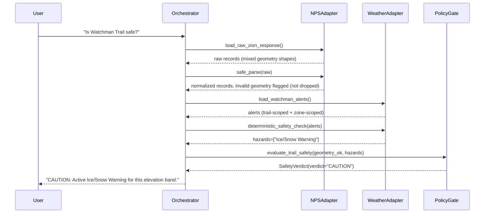

# Workflow Diagram 2: Orchestrator Sequence (The Conductor)

Corresponds to chapter section 1.2 (stop treating the model as a creative
writer; start treating it as a Conductor).

```mermaid
sequenceDiagram
    participant User
    participant Orchestrator
    participant NPSAdapter
    participant WeatherAdapter
    participant PolicyGate

    User->>Orchestrator: "Is Watchman Trail safe?"
    Orchestrator->>NPSAdapter: load_raw_zion_response()
    NPSAdapter-->>Orchestrator: raw records (mixed geometry shapes)
    Orchestrator->>NPSAdapter: safe_parse(raw)
    NPSAdapter-->>Orchestrator: normalized records, invalid geometry flagged (not dropped)

    Orchestrator->>WeatherAdapter: load_watchman_alerts()
    WeatherAdapter-->>Orchestrator: alerts (trail-scoped + zone-scoped)
    Orchestrator->>WeatherAdapter: deterministic_safety_check(alerts)
    WeatherAdapter-->>Orchestrator: hazards=["Ice/Snow Warning"]

    Orchestrator->>PolicyGate: evaluate_trail_safety(geometry_ok, hazards)
    PolicyGate-->>Orchestrator: SafetyVerdict(verdict="CAUTION")
    Orchestrator-->>User: "CAUTION: Active Ice/Snow Warning for this elevation band."
```
