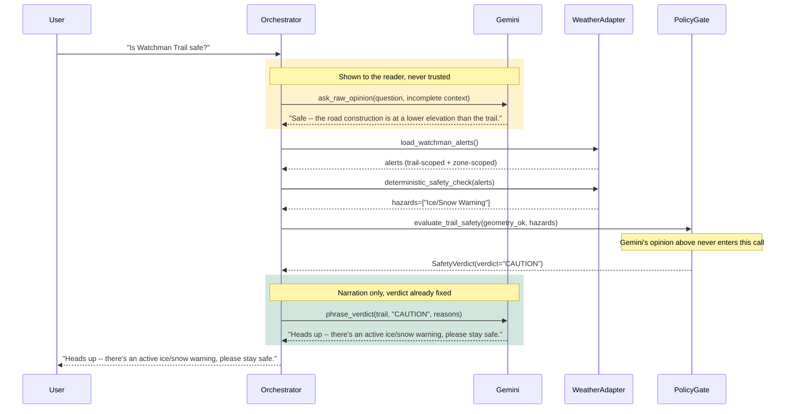

# Diagram 2: Orchestrator Sequence (The Conductor)

Corresponds to section 1.2. The model is not treated as a
decision-maker. It is called twice, for two different jobs, and its
answer in the first call has no path into the second.

This trace shows a real run: Gemini reasons correctly about the one
hazard it was given (a road-construction alert at a lower elevation
than the trail), rules it out, and confidently concludes "safe" -- with
no way to know about the ice/snow warning it was never told about.

