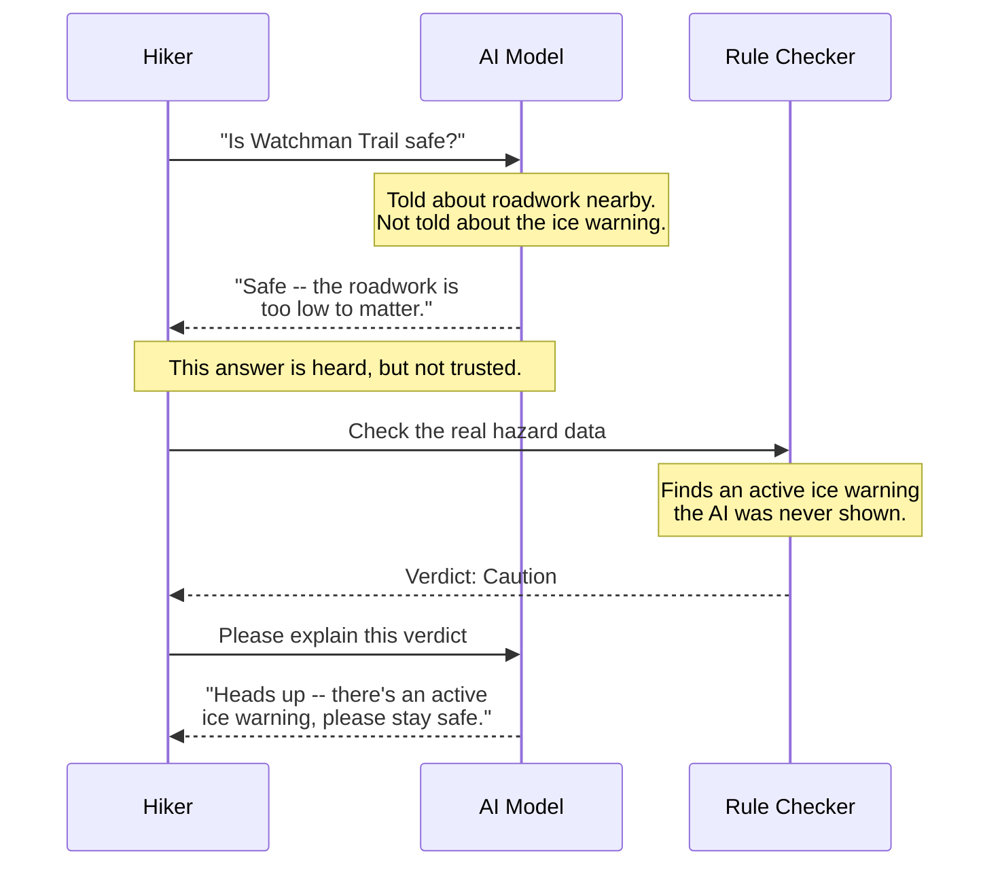

# Diagram 2: What Actually Happened in Demo 2

A real run of this chapter's example, in plain language: the AI
reasons well about the one piece of information it has, and still
reaches the wrong conclusion because it is missing a second, more
important piece.

