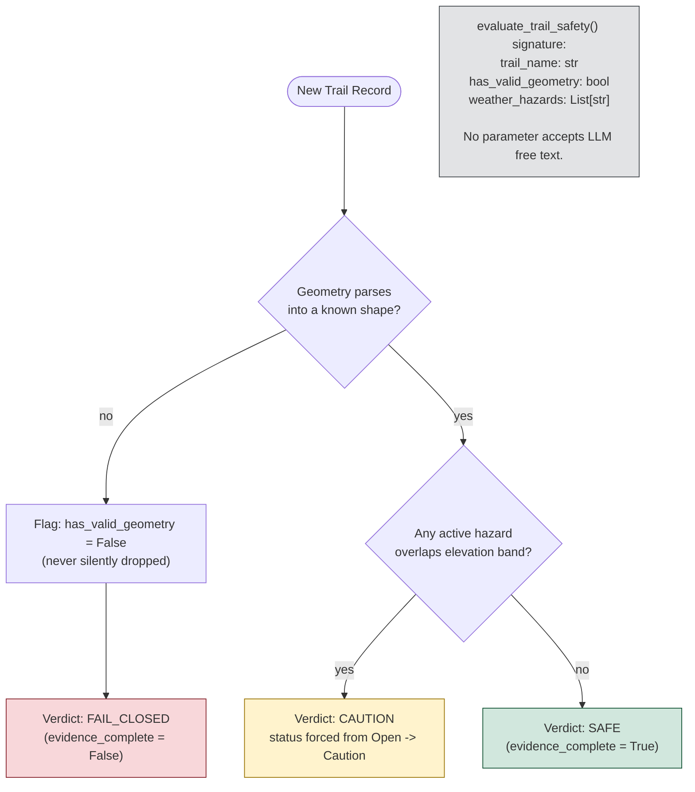

# Workflow Diagram 3: Fail-Closed Decision Flow

Corresponds to section 1.4: the policy gate accepts only typed,
pre-validated evidence -- never LLM-generated free text.

```mermaid
flowchart TD
    Start(["New Trail Record"]) --> G{"Geometry parses<br/>into a known shape?"}
    G -- "no" --> Flag["Flag: has_valid_geometry = False<br/>(never silently dropped)"]
    Flag --> FC["Verdict: FAIL_CLOSED<br/>(evidence_complete = False)"]

    G -- "yes" --> H{"Any active hazard<br/>overlaps elevation band?"}
    H -- "yes" --> CA["Verdict: CAUTION<br/>status forced from Open -> Caution"]
    H -- "no" --> SA["Verdict: SAFE<br/>(evidence_complete = True)"]

    NOTE["evaluate_trail_safety() signature:<br/>trail_name: str<br/>has_valid_geometry: bool<br/>weather_hazards: List[str]<br/><br/>No parameter accepts LLM free text."]

    style FC fill:#f8d7da,stroke:#842029
    style CA fill:#fff3cd,stroke:#997404
    style SA fill:#d1e7dd,stroke:#0f5132
    style NOTE fill:#e2e3e5,stroke:#41464b
```
