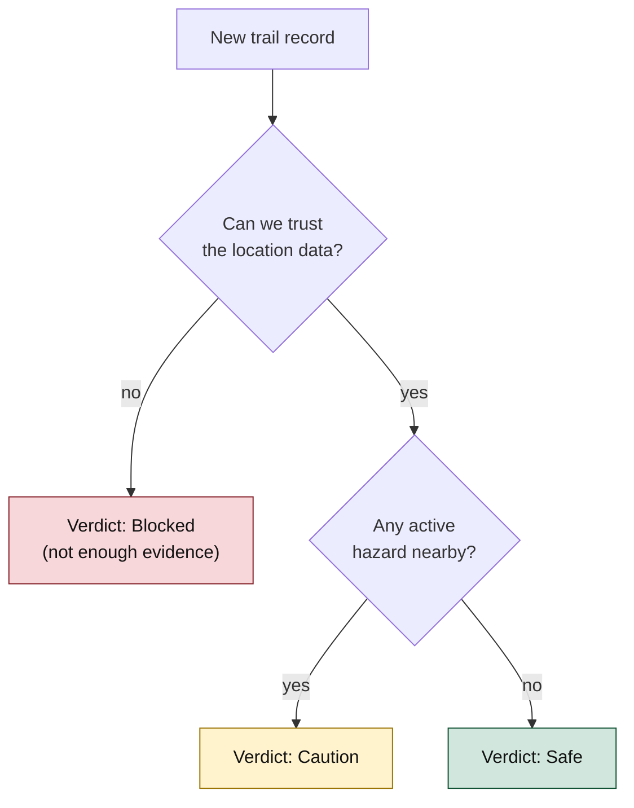

# Diagram 3: The Three Possible Verdicts

However confident the AI sounds, only three outcomes are possible, and
they are decided from the actual data, not from the AI's wording.

```mermaid
flowchart TD
    Start["New trail record"] --> Q1{"Can we trust<br/>the location data?"}
    Q1 -->|no| Blocked["Verdict: Blocked<br/>(not enough evidence)"]
    Q1 -->|yes| Q2{"Any active<br/>hazard nearby?"}
    Q2 -->|yes| Caution["Verdict: Caution"]
    Q2 -->|no| Safe["Verdict: Safe"]

    classDef blocked fill:#f8d7da,stroke:#842029,color:#111111
    classDef caution fill:#fff3cd,stroke:#997404,color:#111111
    classDef safe fill:#d1e7dd,stroke:#0f5132,color:#111111

    class Blocked blocked
    class Caution caution
    class Safe safe
```
